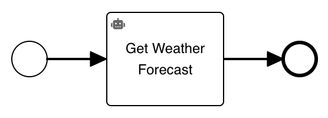

# Flowable Robocorp Client

[License:
](https://github.com/flowable/flowable-external-client-python/blob/main/LICENSE)


This is a python module to connect a Flowable installation through an external worker with a Robocorp task or action.
This allows to execute a Robocorp task/action from a business process with BPMN or a case diagram CMMN.
The application is started with a task/action definition from Robocorp and connects to an external worker topic.
When using the Robocorp task in Flowable, it is possible to specify a task/action name.
In the task, the specific task/action specified will be executed and the result (only for actions) will be sent back to the process.
It is required that the variables in the diagram match exactly the variables inside the robocorp task/action.

## Sample

The following [diagram BPMN](docs/robocorpExample.bpmn) illustrates a basic usage of the Robocorp task:



The following example `get-weather-forecast.py` can be used as a Robocorp action:
```python
from robocorp.actions import action

@action
def get_weather_forecast(city: str, days: int, scale: str = "celsius") -> str:
    """
    Returns weather conditions forecast for a given city.

    Args:
        city (str): Target city to get the weather conditions for
        days: How many day forecast to return
        scale (str): Temperature scale to use, should be one of "celsius" or "fahrenheit"

    Returns:
        object: The requested weather conditions forecast with the temperature as one element
    """

    # your implementation goes here...

    return {
       "temperature": "the weather will be nice"
    }
```

The Robocorp worker can be started with the following command:
```sh
python -m flowable.robocorp_client --flowable-token <your-token> myTopic action get-weather-forecast.py
```

You can request `<your-token>` at the [Flowable Trial](https://trial.flowable.com/work/) by clicking at the bottom left on your user and go to Settings.
Once in the settings, choose "Access Token" and press the button "New token".
After providing name and the validity, the token is generated and can be set.

Once the module is started and a process instance is created, it will automatically execute the Robocorp action and returns the result to Flowable.
The Python module will keep running until stopped to process potential additional jobs.

## Authentication

Next to the cloud authentication, it's possible to authenticate against other hosts.
The hostname can be specified with `--flowable-host`.

For the authentication there are two possibilities:

1. Providing a bearer token with the `--flowable-token <token>` attribute.
2. Providing basic authentication with `--flowable-username <username>` and `--flowable-password <password>`
