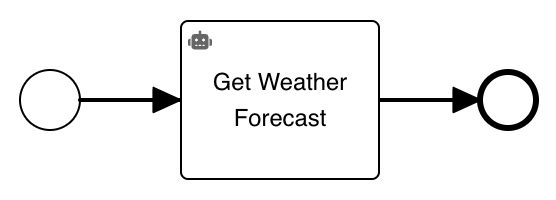

# Flowable RPA Framework Client

[License:
](https://github.com/flowable/flowable-external-client-python/blob/main/LICENSE)


This is a python module to connect a Flowable installation through an external worker with a RPA framework task.
This allows to execute an RPA framework task from a business process with BPMN or a case diagram CMMN.
The application is started with a task definition from RPA framework and connects to an external worker topic.
When using the RPA framework task in Flowable, it is possible to specify a task name.
In the task, the specific task specified will be executed and the result will be sent back to the process.
It is required that the variables in the diagram match exactly the variables inside the RPA framework task.

## Installation

To install the Flowable RPA framework client, execute the following command:

```
pip install flowable.rpaframework-client
```

## Sample

The following [diagram BPMN](docs/rpaframeworkExample.bpmn) illustrates a basic usage of the RPA framework task:



The following example `myTask.robot` can be used as an RPA framework task:
```
*** Settings ***
Library		flowable.rpaframework_client.API

*** Tasks ***
Get weather forecast
    ${city}=		flw input	city
    ${days}=		flw input	days
    ${length}=      Get Length  ${city}
    ${temperature}=     Evaluate    ${days} * ${length}
    flw output		temperature     ${temperature}
```

The RPA Framework worker can be started with the following command:
```sh
python -m flowable.rpaframework_client --flowable-token <your-token> myTopic myTask.robot
```

You can request `<your-token>` at the [Flowable Trial](https://trial.flowable.com/work/) by clicking at the bottom left on your user and go to Settings.
Once in the settings, choose "Access Token" and press the button "New token".
After providing name and the validity, the token is generated and can be set.

Once the module is started and a process instance is created, it will automatically execute the RPA framework action and returns the result to Flowable.
The Python module will keep running until stopped to process potential additional jobs.

## Authentication

Next to the cloud authentication, it's possible to authenticate against other hosts.
The hostname can be specified with `--flowable-host`.

For the authentication there are two possibilities:

1. Providing a bearer token with the `--flowable-token <token>` attribute.
2. Providing basic authentication with `--flowable-username <username>` and `--flowable-password <password>`
